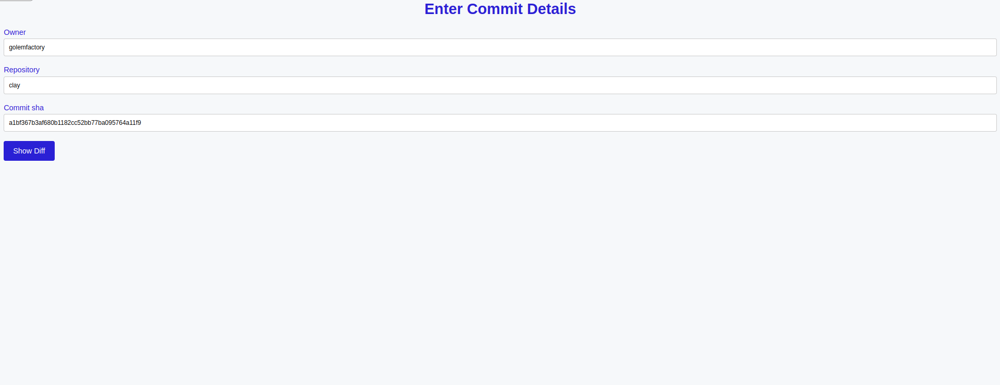
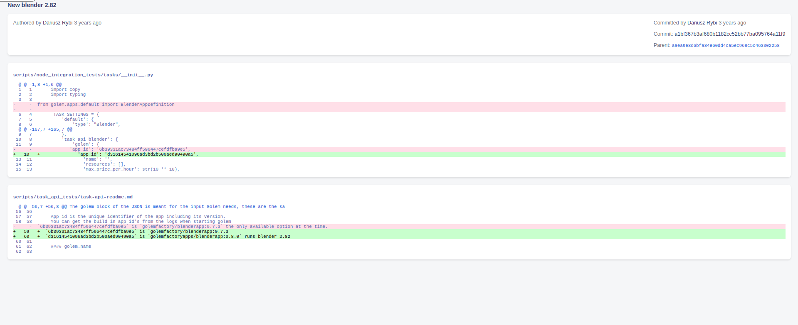

# Commit Diff Viewer

Welcome to **Commit Diff Viewer**, a web application designed to simplify the exploration of code differences in Git commits. This project provides an intuitive user interface, allowing users to input repository details and commit SHA to view essential commit information and visualize code changes seamlessly.

## Overview

- **Commit Details:** Explore commit information, including author, committer, commit message, and timestamp.

- **Code Differences:** Visualize changes made in each file of the commit, with added lines highlighted in green and removed lines in red.

## Screenshots

### Form View

The Form View allows users to input repository details and commit SHA, providing a simple and straightforward way to initiate the commit diff exploration.

### Show View

In the Show View, users can explore the detailed commit information and code differences in a clear and user-friendly format, similar to a GitHub commit page.

### About

This project is designed to enhance the user experience of exploring Git commits, providing a clear and concise representation of code changes.

